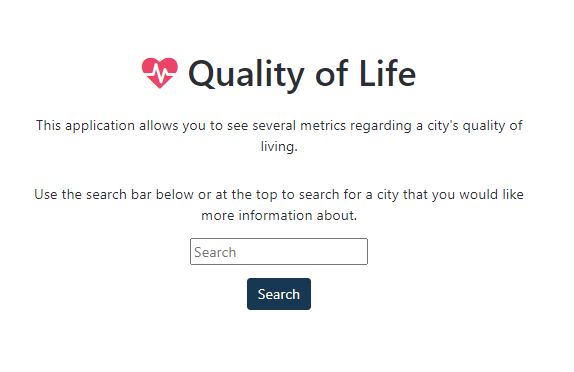
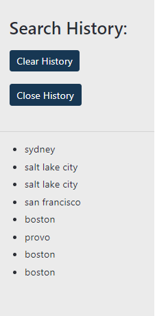
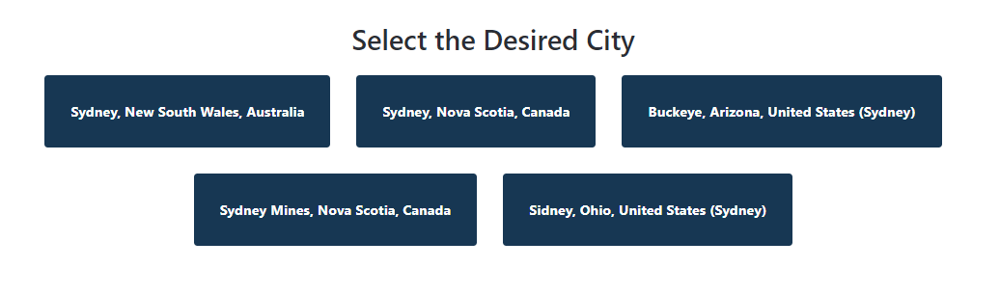
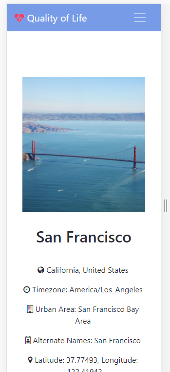
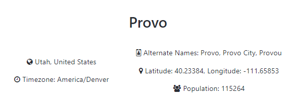
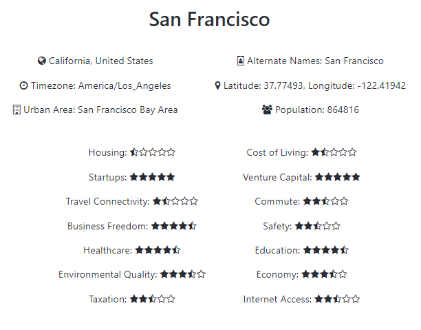
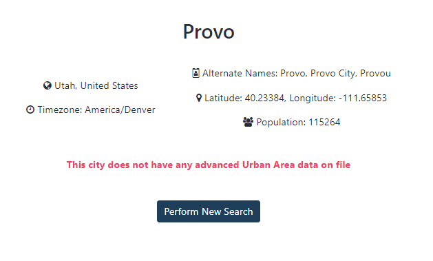
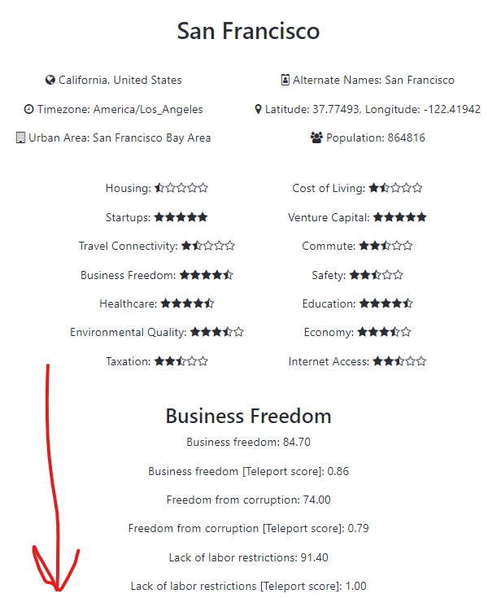

# Quality of Life

&copy; Cody Uhi 2021<br>
This web application allows users to search for a city anywhere in the world and get information about the quality of life associated with that city.<br>
This web application was created for the CS260 Web Development Class at BYU to fulfill the requirements of Creative Project 2.<br>
All data is provided via the Teleport API. Documentation for this API is available at https://developers.teleport.org/

## General Usage

To use this application, you can access it over the internet at http://quality.codyuhi.me or locally by using the code in this repo. To access it locally clone the repo with

```
git clone https://github.com/codyuhi/quality-of-life.git
```

then navigate to the git repo in your machine and start your http server. Open localhost and the app will be available for use.

Open the application in a web browser. On screen, you can either search for a city by using the search bar in the navigation bar at the top of the screen, or by searching from the main prompt in the center of the screen.<br><br>

You can view previous searches by selecting the "Search History" option in the navigation bar. From the Search History tab, you can click on any of the items there to re-search a previously searched city. You can close the Search History tab by either clicking the "Close History" button in the tab, or clicking on the "Search History" option again in the navigation bar. If you want to clear this search history list, select the clear history option in the Search History tab.<br><br>

Once you have performed a search, you will see a list of cities that are similar to the search you provided (if there are no cities with a name similar to the one your provided, you will see an error. Try something else!). Select one of the cities from this list to view more information about the city.<br><br>

After selecting a city, you will see a picture of the city and a lot of information about the city that you can use to learn more about the quality of life that residents of that city experience. Please notice that if the Teleport API does not have advanced data about the city you selected, only simple city data can be displayed (and no picture). If you want to see advanced data about a city's quality of life, make sure to select a city that is closely associated with an urban area (i.e. New York City or San Francisco).<br><br>

## API Usage

The website calls the following API endpoints:

1.  https://api.teleport.org/api/cities/?search=CITY_NAME

- This endpoint provides a list of cities whose names are similar to the one that the user passed as a query parameter to the API
- This functionality is used to provide a list of cities based off the user's input in a search box<br><br><br><br>
- This functionality is also called when the user selects one of the options from the search history. Searching anything will add it to the search history and be persistent within the browser even after the page is closed on this device<br><br>

2.  https://api.teleport.org/api/cities/geonameid:CITY_ID

- This endpoint provides basic information about a city
- This functionality is triggered when the user selects one of the cities from the cities list that is produced in API endpoint number one
- When this functionality is triggered, the user will see basic information about the city that they selected<br><br>

3.  https://api.teleport.org/api/urban_areas/slug:URBAN_AREA_ID/scores

- This endpoint provides a list of ratings that describe the quality of life found in the city being examined
- This functionality is triggered at the same time as API endpoint number two. The data from this operation is displayed on-screen below the basic information provided by API endpoint number two<br><br>
- If the city that was selected from the city list is not associated with an urban area, the user will be notified that there is no advanced data regarding ratings and this data will not be displayed<br>
- The reason why users cannot see the ratings for quality of life for a city without an urban area is because of the limits of the Teleport API

4.  https://api.teleport.org/api/urban_areas/slug:URBAN_AREA_ID/details

- This endpoint provides more details about the urban area that the city is associated with. This detailed data has many diverse uses and offers a window into the urban area that users can compare to their own location
- This functionality is also triggered at the same time as API endpoint number two. The data for this operation is displayed on-screen below the ratings data provided by API endpoint number three<br><br>
- Like API endpoint number three, this section will not load for the user if the city he/she selected is not associated with an urban area

5.  https://api.teleport.org/api/urban_areas/slug:URBAN_AREA_ID/images

- This endpoint returns information about where to access an image related to an urban area. The images available via this endpoint are associated with Creative Commons licenses and are legal for me to display on this site
- This functionality is also triggered at the same time as API endpoint number two. The image that is returned by this operation is displayed along with the data that was provided by endpoint numbers three and four<br><br>
- Like API endpoint numbers three and four, the city image will not load for the user if the city he/she selected is not associated with an urban area

## Installation

1. Clone the repo
```
git clone git@github.com:codyuhi/quality-of-life.git && cd quality-of-life
```

2. Build the Docker image
```
docker build -t game-deals .
```
3. Run the Docker container and expose a port for you to access from localhost
```
docker run -p 90:80 quality-of-life
```
4. Open a browser window and navigate to localhost and the port you opened
   "http://localhost:90"
