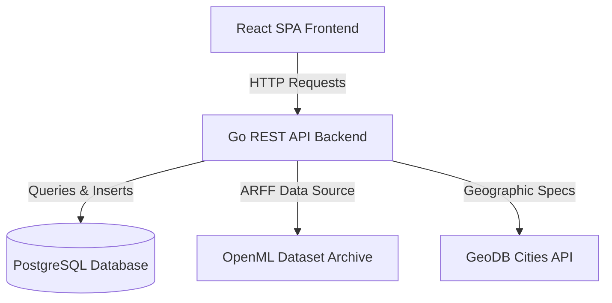
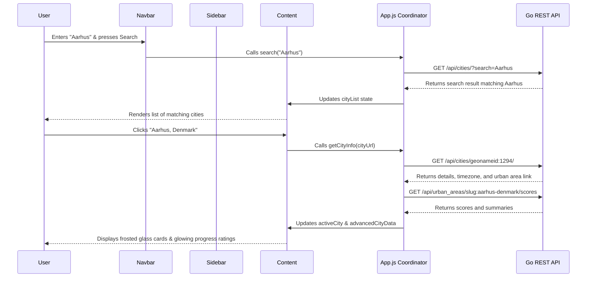

# Quality of Life App

A premium, modern web application that allows users to search for cities around the world and view detailed ratings and statistics regarding their quality of life.

Historically built on the defunct Teleport API, the application has been refactored to run fully self-hosted using a React SPA frontend, a Go (Golang) REST API backend, and a PostgreSQL database.

---

## 1. System Architecture

The application is split into three main components:


```mermaid
graph TD
    Client[React SPA Frontend] -->|HTTP Requests| GoServer[Go REST API Backend]
    GoServer -->|Queries & Inserts| Postgres[(PostgreSQL Database)]
    GoServer -->|ARFF Data Source| OpenML[OpenML Dataset Archive]
    GoServer -->|Geographic Specs| GeoDB[GeoDB Cities API]
```

### A. React SPA Frontend (`/app`)
* **Framework**: React 18 SPA built with functional Hook components.
* **Styling**: Vanilla CSS featuring a premium slate-dark glassmorphism theme (`#0a0f1d`), modern typography (`Inter`), responsive Flexbox/Grid layouts, and custom glowing progress meters for scores.
* **Client**: Axios is used to fetch city ratings and data dynamically from the Go REST API.

### B. Go REST API Backend (`/server`)
* **Language**: Go (Golang) 1.22+ utilizing the high-performance standard library `net/http` server.
* **Security**: Zero hardcoded credential defaults. Strict environment variable validation (`DB_HOST`, `DB_PORT`, `DB_USER`, `DB_PASSWORD`, `DB_NAME`) immediately aborts startup if configurations are missing.
* **Endpoints**: Exposes mock-compatible routes matching the original Teleport URL structure:
  - `GET /api/cities/?search=:query` - Searches for cities matching the pattern.
  - `GET /api/cities/geonameid::id/` - Returns basic city details, timezone, and population.
  - `GET /api/urban_areas/slug::slug/scores` - Returns the 14 quality-of-life categories and a calculated composite rating.
  - `GET /api/urban_areas/slug::slug/details` - Returns granular local specs (cost of living details, currency conversions, metrics).
  - `GET /api/urban_areas/slug::slug/images` - Fetches attribution and matching Wikipedia mobile/desktop cover images.

### C. PostgreSQL Database
* **Relational Schema**: Consists of two core tables:
  - `cities`: Stores coordinates, timezones, country mappings, populations, and unique slugs.
  - `scores`: Holds category ratings, custom summaries, and final composite quality-of-life metrics.

---

## 2. Frontend Component Interactions

The frontend follows a coordinate-state design centered around [App.js](app/src/App.js):


```mermaid
sequenceDiagram
    participant User
    participant Navbar
    participant Sidebar
    participant Content
    participant App as App.js Coordinator
    participant API as Go REST API

    User->>Navbar: Enters "Aarhus" & presses Search
    Navbar->>App: Calls search("Aarhus")
    App->>API: GET /api/cities/?search=Aarhus
    API-->>App: Returns search result matching Aarhus
    App->>Content: Updates cityList state
    Content-->>User: Renders list of matching cities
    User->>Content: Clicks "Aarhus, Denmark"
    Content->>App: Calls getCityInfo(cityUrl)
    App->>API: GET /api/cities/geonameid:1294/
    API-->>App: Returns details, timezone, and urban area link
    App->>API: GET /api/urban_areas/slug:aarhus-denmark/scores
    API-->>App: Returns scores and summaries
    App->>Content: Updates activeCity & advancedCityData
    Content-->>User: Displays frosted glass cards & glowing progress ratings
```

---

## 3. Database Seeder Mechanism

When the Go backend starts up and detects that the `cities` table is empty (`count == 0`), it automatically triggers a database seeding worker in the background:
1. **Historic Scores Download**: Fetches the static historic Teleport scores dataset (`City-Quality-of-Life-Dataset.arff`) containing the final snapshot of the Teleport Quality of Life database from OpenML.
2. **Metadata Resolution**: Queries the free **GeoDB Cities API** to extract real-world timezones, coordinates, and populations.
3. **Robust Constraint Conflict Resolution**:
   - **URL Escaping**: Query prefixes are URL-escaped to allow multi-word cities (e.g. `San Jose`, `New York`) to query successfully.
   - **Duplicate City Name Handling**: Uses a state and country lookup (`getCountryISO`) to filter search parameters using `countryIds`. This prevents duplicate city names in different countries (e.g. `London, UK` vs `London, Canada`) from resolving to the same ID.
   - **Unique Fallbacks**: Generates fallback IDs using `1000000 + loop_index` to prevent unique key violation rollbacks, ensuring exactly **265 cities** seed successfully into the DB.

---

## 4. Local Development & Setup

### Prerequisites
* [Docker](https://www.docker.com/) (to run PostgreSQL locally)
* [Go 1.22+](https://go.dev/)
* [NodeJS & Yarn](https://yarnpkg.com/)

### Step 1: Start PostgreSQL
Run a local PostgreSQL instance in Docker:
```bash
docker run -d \
  --name quality-of-life-db \
  -p 5432:5432 \
  -e POSTGRES_DB=quality_of_life \
  -e POSTGRES_USER=postgres \
  -e POSTGRES_PASSWORD=postgres \
  postgres:15
```

### Step 2: Configure and Run the Go Backend
1. Navigate to the server directory:
   ```bash
   cd server
   ```
2. Create a `.env` file containing configuration variables:
   ```env
   DB_HOST=localhost
   DB_PORT=5432
   DB_USER=postgres
   DB_PASSWORD=postgres
   DB_NAME=quality_of_life
   DB_SSLMODE=disable
   ```
3. Run the Go server:
   ```bash
   go run .
   ```
   *Note: On first launch, the seeder will start downloading and populating the database. It sleeps 1.2s between cities to prevent GeoDB rate-limiting, taking ~5 minutes to complete.*

### Step 3: Run the React Frontend
1. Navigate to the app directory:
   ```bash
   cd app
   ```
2. Install dependencies:
   ```bash
   yarn install
   ```
3. Start the React development server:
   ```bash
   yarn start
   ```
4. Open your browser to `http://localhost:3000`.

---

## 5. Running Tests

### Backend Unit Tests
The Go test suite stubs database calls and tests JSON responses and HTTP status codes:
```bash
cd server
go test -v .
```

### Frontend Unit Tests
Jest tests verify the layout, placeholders, and interactive components:
```bash
cd app
yarn test --watchAll=false
```
